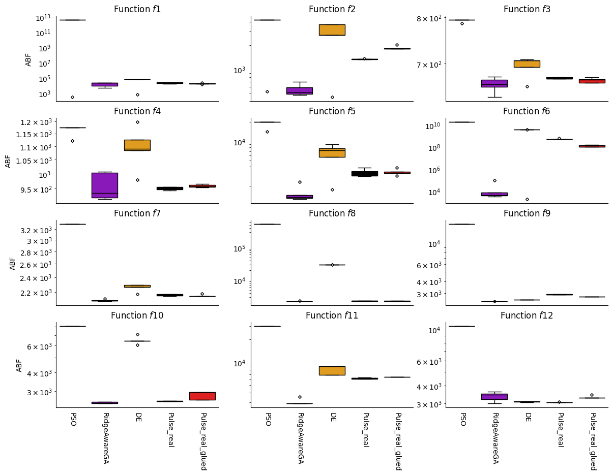

# Pulse with EVOX

 EVOX is a relatively recent framework for scalable evolutionary computation. Frameworks like these are extremely underrated, especially when their engineering design is intelligent and sufficiently abstracted for different purposes. 
 Evolutionary computation is extremely broad both in terms of theory and applications. Much like other areas of AI, it will only explode once GPU acceleration (through JAX or any other libraries) becomes ubiquitous in the field. 
 The objective of this project is to eventually implement/port my algorithms (Pulse) and build a similar testing structure as in my [thesis](https://run.unl.pt/bitstream/10362/145483/1/TCDMAA2413.pdf)/[paper](https://link.springer.com/book/10.1007/978-3-031-29573-7). 
 Update: numerical and neuroevolution tests (in a brax library environment and more recently with MuJoCo engine) implemented. 

## CEC2022 20D - 30 seeds

### Elite Fitness Trajectories 
(RidgeAwareGA is simply Pulse2 but I didn't want to re-run after I started disliking the name)

### ABF boxplots

## Neuroevolution - Walker Walk (MJX) 

Visualization of a MLP evolved with the improved Pulse2 (EA) algorithm for bipedal walking:

## Neuroevolution - Cartpole Balance (MJX)

Visualization of a simple MLP evolved with Pulse (EA) to balance a cartpole:

