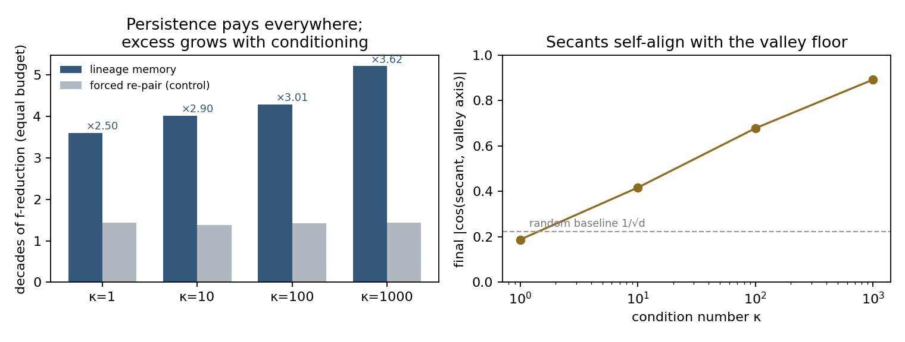
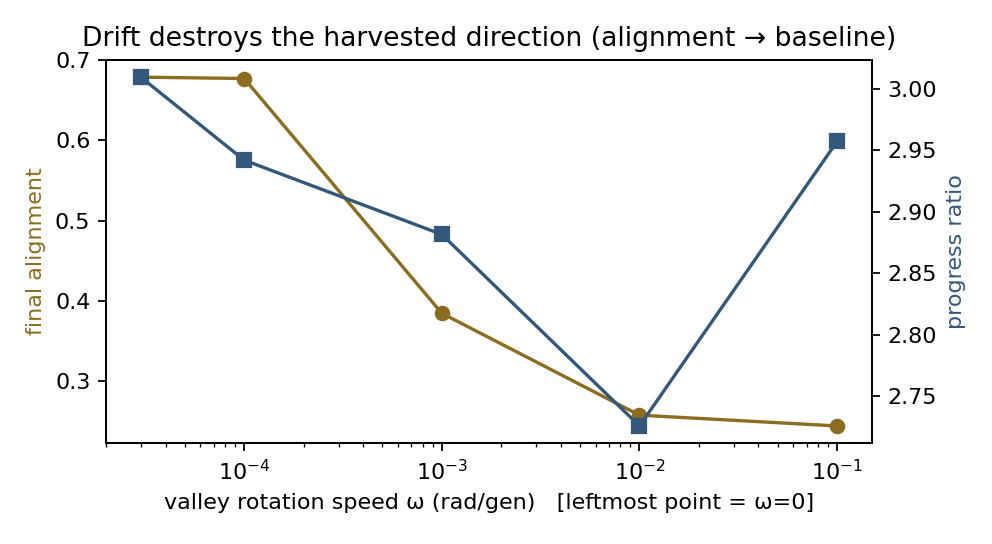
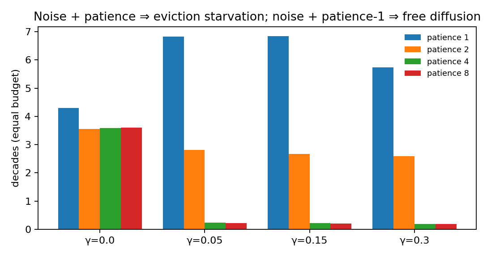

# Direction-Lifetime Study — motor vs steering in pair-lineage search

A minimal-model test of the amortization theory behind LinePulse: *scalar-feedback
search pays an Ω(d) price to acquire a direction; lineage memory amortizes that
price over cheap 1-D exploitation; the payoff should scale with how long the
landscape keeps a direction useful.* Five pre-registered predictions, one
matched-operator control, ~1 minute of compute.

## Model

One landscape family covers every condition:

```
f_t(x) = 1/2 · ( κ·||x||² − (κ−1)·(u_t·x)² )
```

curvature 1 along the valley axis `u_t`, κ orthogonal to it; κ=1 is the sphere.
Optimum fixed at the origin. Under drift, `u_t` rotates at ω rad/generation in a
fixed random 2-plane (the valley re-orients; the optimum doesn't move).
Multiplicative evaluation noise: `f_obs = f·(1 + γz)`, z ~ N(0,1).

**Memory variant** = minimal LinePulse: pairs, uniform-α crossover along the pair
secant, keep-best-2 of {P1,P2,C1,C2}, patience-m eviction, broken pairs re-pair
among the freed pool and fire one ray `C = P ± σ(X[r2]−X[r3])`. All four
candidates evaluated fresh each generation (no cached fitness).

**Control** = identical operators, but all pairs are randomly re-formed every
generation (no persistence); ray probability matched to the memory run's
measured ray fraction, same seed. Persistence is the only variable.

Protocol: d=20, pop=400 (200 pairs — the CEC-track regime), 1500–3000
generations, 6 seeds, medians. Primary metric: decades of true-f reduction in an
equal evaluation budget (robust to stalls). Instruments: pair lifetime L
(generations survived), final |cos(secant, u)| vs the random baseline
1/√d ≈ 0.224, ray fraction.

## Results

### κ sweep — persistence pays everywhere; the *excess* is the coherence harvest

| κ | decades (memory) | decades (control) | ratio | excess vs κ=1 | pair lifetime L | final alignment |
|---:|---:|---:|---:|---:|---:|---:|
| 1 | 3.60 | 1.44 | **2.50** | 1.00 | 19.7 | 0.19 (≈ baseline) |
| 10 | 4.02 | 1.38 | 2.90 | 1.16 | 19.7 | 0.42 |
| 100 | 4.29 | 1.43 | 3.01 | 1.21 | 19.1 | 0.68 |
| 1000 | 5.22 | 1.44 | **3.62** | **1.45** | 17.4 | **0.89** |



### Drift sweep (κ=100) — rotation destroys exactly the harvested component

| ω (rad/gen) | ratio | final alignment |
|---:|---:|---:|
| 0 | 3.01 | 0.68 |
| 1e-4 | 2.94 | 0.68 |
| 1e-3 | 2.88 | 0.39 |
| 1e-2 | 2.73 | 0.26 |
| 1e-1 | 2.96* | 0.25 |

Alignment collapses to the random baseline as ω grows; the ratio sheds its
κ-excess and returns to motor-level (~sphere) values. *The ω=0.1 uptick is
within 6-seed noise — at that speed the rotating valley time-averages toward a
different effective landscape for both variants.



### Patience × noise (κ=100) — the starvation cliff

| γ | m=1 | m=2 | m=4 | m=8 | m* |
|---:|---:|---:|---:|---:|---:|
| 0.00 | **4.29** | 3.55 | 3.58 | 3.60 | 1 |
| 0.05 | **6.83** | 2.81 | 0.24 | 0.21 | 1 |
| 0.15 | **6.84** | 2.66 | 0.22 | 0.20 | 1 |
| 0.30 | **5.74** | 2.59 | 0.19 | 0.19 | 1 |



## Verdicts on the pre-registered predictions

| # | Prediction | Verdict |
|---|---|---|
| P1 | no memory edge on the sphere | **falsified, informatively** — 2.5× even at κ=1 |
| P2 | edge grows with κ | **confirmed** — monotone, +45% excess at κ=1000 |
| P3 | drift kills the edge | **confirmed via mechanism** — alignment → baseline, κ-excess vanishes |
| P4 | m*=1 noiseless; m* grows with noise | **half confirmed, half inverted** — m*=1 always; patience under noise is catastrophic, not conservative |
| P5 | secants self-align with the valley floor | **confirmed** — 0.19 → 0.89, tracking κ |

## The two findings that revise the theory

**1. Persistence decomposes into a motor and a steering component — and the
steering flows through the cloud, not the pair.** Pair lifetimes are ~19
generations *independent of κ*: lifetime measures how long a 1-D bracket takes
to grind down (the motor), which is why destroying persistence costs 2.5× even
on the sphere — the control never finishes a line search. The κ-dependent
benefit appears instead in the alignment of *newly formed* secants and rays:
the population's accumulated anisotropy enriches every new acquisition. In the
amortization identity `progress ∝ L·δ/(A + cL)`, the coherence harvest enters
through **A_eff (acquisition quality from the enriched cloud)**, not through
longer rides L. Even in a lineage algorithm, the strategic asset is the cloud's
covariance; lineages are the tactical motor.

**2. Under noise, the binding eviction risk is false *retention*, not false
eviction.** The verdict is asymmetric: one lucky offspring survival resets the
fail counter, while a break requires both offspring to lose. With noise, a
collapsed pair "survives" by luck often enough that patience ≥ 2 means eviction
almost never fires → no rays → the population freezes (0.2 decades vs 6.8).
A correct eviction rule must be two-sided: break on evidence of deadness **and
force-break on pair collapse** (pair distance below the noise-equivalent
resolution). One-sided patience is a trap in stochastic-fitness settings.

**Provisional bonus:** mild selection noise at patience 1 *beat* the noiseless
runs by ~60% (6.8 vs 4.3 decades) — selection errors act as the diffusion term
a contraction-only flow lacks (more breaks → more rays → more hull movement),
with an annealing-like sweet spot at moderate γ. Needs replication under a
different noise model before trusting; mechanism is coherent.

## Design carry-overs

1. Add a **collapse trigger** to eviction (pair distance < noise floor) before
   ever raising patience — directly relevant to the stochastic-fitness (LLM)
   track.
2. Log **secant alignment** against reference directions as a live instrument —
   it tracked every effect in this study.
3. Test **stochastic selection** (small fitness jitter / ε-greedy acceptance)
   in pulse14 — a one-flag experiment with a potential ~1.5× in-model payoff.

## Caveats

Minimal model: no bounds/glued space, fresh evaluations, single regime
(d=20, pop=400), 6 seeds, multiplicative noise only. The control ablates motor
and steering together — the sphere ratio is the motor baseline; κ-excess is the
steering readout. Decades-in-budget mixes transient and asymptotic phases.

## Run

```
../.venv/bin/python lifetime_sim.py     # ~1 min, writes lifetime_sim_results.jsonl + summary
../.venv/bin/python plot_results.py     # regenerates the three figures
```
